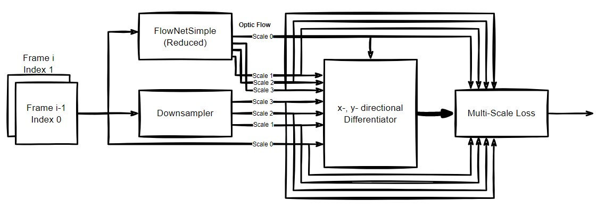
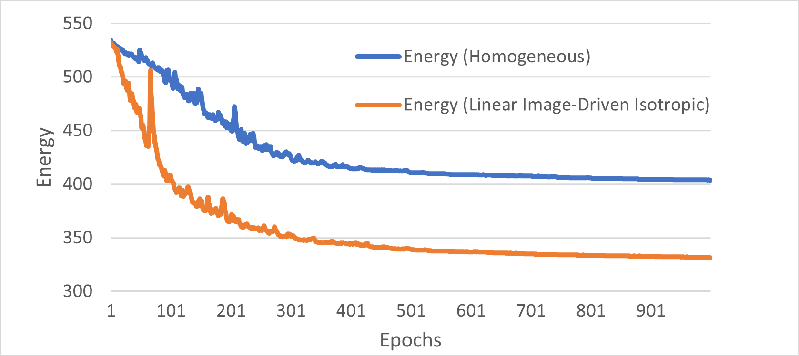
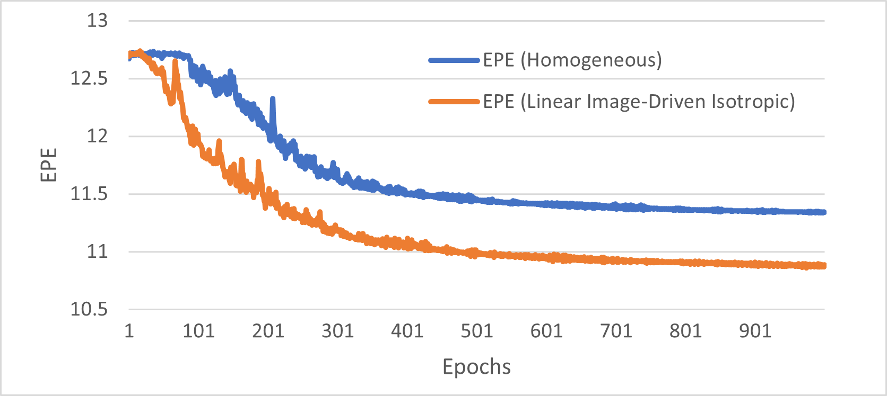
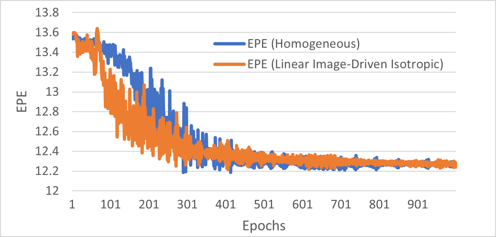
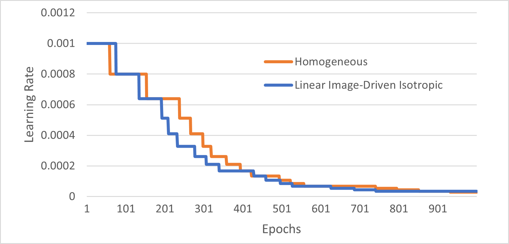

# Multi-Scale based Optic Flow Computation with Deep Energy 
### A CNN based computation of Optic Flow by unsupervised means using Multi-Scale Deep Energy Reduction

Check for sample video results on YouTube: https://youtu.be/dsnJEqtevwU

## Abstract
Advancement in Deep Learning has opened a portal for a variety of applications. Such an application includes image analysis and synthesis that range from image-to-image tasks such as denoising, in-painting, and segmentation to classification with other tasks. In our work, we used the idea of using Deep Energy to train a model for computing optic flow field, given a pair of subsequent frames. This task is relevant in self-driving technology, stereo reconstruction, and image registration. Our work uses variational calculus to design an computed-optic-flow-IIDR-slowed.mp4energy loss function to train a deep learning model without using ground truths. It is similar to the Physics-Informed Neural Networks, where the goal is to use the PDEs to minimize the residual loss and allow the model to train from the given loss by updating its corresponding weights. The dataset consists of synthetic video frames provided by MPI-Sintel generated using Blender software. 

## Introduction
For decades researchers came up with different numerical schemes and algorithms which can compute optic flow given a pair of subsequent frames. These were slower because the algorithm computes the optic flow for each pair of frames in several iterations. They come in the category of local and global techniques with advantages and disadvantages. [7] proposed the first local method where they assumed that the brightness of pixels is equal for both frames given the illumination is constant. With this assumption, we can draw an optic flow constraint that is solved to compute the components of the flow field by using a window. Having a window,  the linear system of equations is overdetermined because we assume the flow fields are equal in the window. Then it is solved via the least square methods.

At the same time, [6] proposed a global technique that uses variational calculus which converts the flow field computation into a minimization task. They derived an energy functional that is minimized to solve for the components of the flow field by using similar assumptions as for the local method with an addition of a smoothness assumption. In such an assumption, the resulting optic flow is smooth and does not have discontinuities. 

These methods use explicit numerical schemes where the algorithm has to be iterated several times for a given pair of frames to compute the respective optic flow. The number of iterations can range from 1000 to 100000 or more. For this reason, implementing it for real-time optic flow computation is cumbersome. So researchers came up with techniques that use deep learning and variational energy to train the model for computing the flow fields. Then the trained model can perform real-time optic flow computation. 

Variational energy as the loss function comes under the domain of unsupervised learning. In the supervised approach, we use the ground truth to model the loss function that performs better than the unsupervised approach in most cases. But there are more benefits to an unsupervised approach. For instance, providing the model with unannotated data is efficient. The model can be updated when deployed in an application. So this allows for continuous learning with newer data and better performance with time.

## Related Works
The method proposed by [7] experienced the aperture problem because of the small window size where flow fields become harder to compute when the linear system of equations is under-determined. To solve this, [6] introduced a global technique using variational energy under the assumption of brightness constancy and a smoother flow field. They used homogeneous diffusion weighted with a parameter alpha to introduce smoothness into the flow field. The smoothness and the data term lead to a diffusion-reaction process. They designed an energy functional that has a data term $E_{data}$ and a smoothness term $E_{smooth}$ as shown in the following.

$$E_{data} = |I(x+u, y+v, z+1) - I(x, y, z)|^2$$

Where $I(x+u, y+v, z+1)$ is the image at time unit $z+1$.

$$E_{smooth} = |\nabla u|^2 + |\nabla v|^2$$

Where $u, v$ are the flow field in the direction of x and y respectively. The final variational energy has the following form.

$$E(u,v) = \int (E_{data} + \alpha E_{smooth}) dxdy$$

Since then, the global variational approach has been the most popular among all other classical methods. There are several modifications to the energy functional where researchers tried different assumptions such as gradient and hessian constancy proposed by [2] and a variety of models for the data and the smoothness terms. It works very well for sequences with smaller displacements but fails for larger displacements. 

For that, [2] added a multi-scale extension to the technique proposed by [6] in which they introduced a coarse-to-fine strategy to compute the optic flow starting from the lowest resolution. The displacements are much smaller at a smaller scale where the variational approach can perform well. After calculating the flow fields at a lower resolution, it is up-sampled by interpolation and then set as initialization for computing optic flow at the finer scale. The steps are repeated till the main scale is achieved.

Since these techniques use explicit numerical schemes, it was still not implemented in neural networks. [4] proposed an encoder-decoder network similar to U-Net termed FlowNet that allows for optic flow computation with higher accuracy. It was one of the first leaps in using a deep neural network model for optic flow computation. They used a supervised approach to train the model but later researchers used the ideas from FlowNet and combined them with a variational approach to train the model. It turned out that with the encoder-decoder style of FlowNet, it is possible to use it for multi-scale optic flow computation. Numerous extensions for FlowNet architecture have since been proposed.

Inspired by these ideas, our work makes the use of variational energy with a non-quadratic penaliser, coarse-to-fine warping, and an advanced smoothness assumption to construct a loss function that may improve the performance of an unsupervised deep learning model. To design the model, we used the ideas from FlowNet architecture and reduced the overall size to make it compatible with the available hardware for training.

## Methodology
In this section, we discuss the implementation of our project. We will first discuss the mathematical modeling for the variational energy followed by the model architecture and approaches we used. Then we will also discuss how the data set was prepared and processed.

### Mathematical Modelling
For modeling the data-term, we used the sum of squared differences (SSD) between the warped and the original frame through the computed optic flow. It is based on the assumption that the brightness of the two subsequent pixels stays the same. We used the albedo version of the MPI-Sintel dataset that satisfies this assumption. The SSD passes through a non-quadratic penaliser proposed by [3] which is as follows.

$$\psi_D (s^2) = \sqrt{\epsilon^2 + s^2}$$

This penaliser is convex and makes the modeling more robust against outliers and noises. Let ${I_0, I_1}$ be the subsequent frames, then our final data term is shown in the following equation.

$$E_{data} = \psi_D(|I_{warped} - I_0|^2)$$

where $I_{warped}$ is the inverse warped version of $I_1$ using the computed optic flow $(u, v)$. We also added a smoothness term similar to the one proposed by [6]. More specifically, we used a linear isotropic image-driven diffusion proposed by [1] which is as follows.

$$E_{smooth} = \psi_S(|\nabla I_0|^2)(|\nabla u|^2 + |\nabla v|^2)$$

where $\psi_s(s^2)$ is a diffusivity function proposed by 
[8] which is as follows.
$$\psi_S(s^2) = \frac{1}{1+ s^2/\lambda^2}$$

This diffusivity is inversely proportional to the gradient magnitude of the frame $I_0$ which means that at larger gradients, the diffusivity is smaller hence edges are preserved. For comparing the effect of using both isotropic and homogeneous modeling for the smoothness term, we set up two experiments on the two smoothness models discussed in section 4.

### Deep Learning Model
Our deep learning model is inspired by FlowNetSimple architecture proposed by [4] and the ResNet50 architecture proposed by [5]. Our hybrid model is a shrunk version of the FlowNetSimple and the only extra feature is the residuals added in the encoder part of the network. We reduced the number of convolutional layers and the number of filters for each convolution such that our highest number of channels is 64, whereas, in the FlowNetSimple, the highest number of channels is 1024. We then added multi-scale losses with the help of our down-sampler and the differentiation block. The final loss is computed by summing the multi-scale losses weighted by a monotonically decreasing weighting factor with increasing resolution. This way, we can emphasize more towards the smaller scale which acts as a recipe for computing optic flow at a larger scale in a pyramidal fashion. The complete abstract view of the architecture is shown in figure 1.

**Figure 1**: *Abstract view of the complete architecture*

For each scale, we compute the energies using the specified data and smoothness terms. The energies are summed for each pixel in an image. The down-sampling block performs average pooling with a kernel size of 2. The input frames and the optic flows at each scale must match their dimensions. So in the reduced FlowNetSimple architecture, we added padding to each convolution/de-convolution layer while performing down-sampling through average pooling to keep the dimension consistent and easier to manage. 

To make the differentiator block efficient, we stacked the $(u, v)$ component of the optic flow, and the frames $I_0$ and $I_1$ depth-wise into tensors for each scale. Then we apply depth-wise convolution with x- and y-directional 3x3 Sobel operators. The output of x- and y-directional Sobel operation is then concatenated depth-wise i.e. let $T$ be the input to the differentiator block, then the output will be ${T_x, T_y}$ for each scale.

To design a relatively small architecture, we started with a bigger version of the modified FlowNetSimple model with more layers and channels. Then by performing several experiments, we shrunk the number of trainable weights from ~7M to ~170K. More specific details regarding the model are described in table 1.
| Activation | Batch Norm | Pooling | Residuals | U-Net-like | Parameters \# | layers (including concat & diff blocks) |
|------------|------------|---------|-----------|------------|---------------|-----------------------------------------|
| Leaky ReLU | No         | Average | Yes       | Yes        | 171,846       | 92                                      |

**Table 1**: *Reduced FlowNetSimple Configuration*

### Preparing Dataset
The dataset was taken from the albedo version of the MPI-Sintel dataset that satisfies the brightness constancy assumption. This was a better choice considering the scale, complexity, and scope of the project. The dataset consists of 1064 frames with an average of 50 frames per scene. To make the training pipeline efficient, we used gray-scale images and stored the subsequent frames in a serialized *tfrecord* format. This also includes storing the ground truths in a 3-dimensional tensor format for evaluating the performance (Note: Ground truths are not used to train the model). Before serializing to *tfrecord*, the images and ground truth are all resized and cropped to (128x256). We used multiple *tfrecord* files to store the frames and ground truth to make it easy for splitting the data into training and validation sets. 

## Experimentation and Results
We split the dataset with a ratio of 80\%:20\% for training and validation respectively. There was also a test set provided by the dataset but to a lack of available ground truth, it was not possible to evaluate the performance. There are several parameters that we had to tune after several rounds of experimentation.

### Evaluation Metrics
To make the evaluation comparable to other published articles and the supervised approaches, we used the average end-point-error (EPE) which is the average euclidean distance between the predicted optic flow and the ground truth. For each $(u_{pred}, v_{pred})$ and $(u_{gt}, v_{gt})$, we compute the euclidean distance for each point and then average it across the whole image. The equation to compute the EPE is shown in the following. 

$$EPE =\frac{1}{MN}\sum_{i}^N\sum_{j}^M \sqrt{(u_{pred} - u_{gt})^2 + (v_{pred} - v_{gt})^2}$$

### Training Configuration

| Experiment Nr. | $\alpha_{0}$ | Decay | Patience (epochs) | $\beta_{1}$ | $\beta_{2}$ |
|----------------|----------------------------------|-------|-------------------|---------------------------------|---------------------------------|
| 1              | 0.001                            | 0.01  | 12                | 0.9                             | 0.999                           |
| 2              | 0.001                            | 0.01  | 12                | 0.9                             | 0.999                           |

**Table 2**: *Adaptable learning rate decay configuration*

| Experiment Nr. | $\alpha$ | $\lambda$ | $\epsilon$ | Multi-scale weights     | Epochs | Batch size | Diffusivity        |
|----------------|------------------------------|---------------------------------|--------------------------------|-------------------------|--------|------------|--------------------|
| 1              | 0.01                         | None                            | 0.001                          | [0.2, 0.4, 0.6, 0.8, 1] | 4000   | 128        | None (Homogeneous) |
| 2              | 0.01                         | 0.005                           | 0.001                          | [0.2, 0.4, 0.6, 0.8, 1] | 4000   | 128        | Perona-Malik       |

**Table 3**: *General Training Configuration*

To make the training efficient, we concatenated the two subsequent frames depth-wise in a single tensor. Then we group it with the ground truth and then batched it. This is useful to compute the EPE during the training and keep track of the performance efficiently in real-time. For each batch of inputs, we receive a batch of individual energy (multi-scale energies summed up). These energies are used to compute the gradients that are aggregated over the whole batch.

To update the model using the computed gradients, we used an Adam optimizer with an adaptable learning rate scheme. We set the initial learning rate $\alpha_{0}$ to 0.001 and then decrease it whenever the average energy of a batch starts to flatten with a decay factor of 0.8 and patience of 12 epochs. Patience describes the number of epochs to wait before decaying the learning rate. Also to make the results comparable, we set the same values for the parameters in both experiments. This is summarized in table 2.

During training, we set the batch size to 128 for both the validation and training pipeline. The data are ordered scene-by-scene without any shuffling. In table 3, we summarize all the important configuration including the regularization parameter $\alpha$, the diffusivity parameter $\lambda$, the multi-scale weights (starting from the highest scale to lowest), and the number of epochs.  

### Results
In table 4, we perform the comparison of the EPE obtained on the whole dataset with methods and models proposed by other people. Considering the simplicity of our approach, the results are quite reasonable as the model is able to provide a good optic flow estimate, especially with linear isotropic smoothing. 

This can be analyzed further from figure 7, where the visual results obtained at the largest scale for both experiments are displayed along with the ground truth. The differences between homogeneous and isotropic smoothing are very notable whereas, in isotropic smoothing, the edges are well preserved with the use of an adaptive diffusivity function. This diffusion process is still isotropic which means that it still does not have a preferred direction as opposed to anisotropic. The color scheme for representing the optic flow used in this work is shown in figure 2.

| Methods      | Models                      | EPE           |
|--------------|-----------------------------|---------------|
| Unsupervised | FlowNet[10]            | 11.19         |
| Unsupervised | Ours (Homogeneous)          | **11.16**  |
| Unsupervised | Ours (Linear ID Isotropic)  | **10.7** |
| Supervised   | FlowNetSimple[4] | 8.43          |
| Unsupervised | DeepFlow[9]  | 7.21          |

**Table 4**: *EPE Comparison*

**Figure 2**: *Color scheme for representing optic flow*

Figure 3 represents the variational energy plotted for the first 1000 out of 4000 epochs for better visibility. With linear isotropic smoothing, the convergence is much faster and is able to minimize the energy more than the homogeneous smoothing. A similar characteristic can also be observed for the end-point error shown in figure 4. Both figure 3 and 4 shows the data for the training performance. For validation, in figure 5, we can see the final end-point errors for both experiments are almost equal (mainly due to the smaller validation data set size), however, the convergence is faster with the linear isotropic smoothing. Finally, in figure 6, we can see the characteristics graph for our adaptive learning rate schedule. We observed that using such a schedule allows for faster convergence under 4000 epochs as compared to 30k~100k epochs because we can start with a relatively larger learning rate and then decrease whenever required.

**Figure 3**: *Variational energy (Training) over 1000 epochs*

**Figure 4**: *End-point-error EPE (Training) over 1000 epochs*

**Figure 5**: *End-point-error EPE (Validation) over 1000 epochs*

**Figure 6**: *Learning rate schedule over 1000 epochs*

**Figure 7**: *Samples from the dataset with (a) subsequent frames superposed, (b) ground truth, (c) results by using homogeneous diffusion as the smoothness assumption, (d) results by using image-driven isotropic regularization as the smoothness assumption*

## Conclusion
In conclusion, our primary goal was to use deep learning and variational energy for computing optic flow that can be useful for real-time applications. We were able to achieve reasonable results with a relatively smaller model and simpler approach. To find the best mathematical model for training the neural network, we performed two sets of extensive experimentation mainly focusing on the smoothness assumption. It turns out that the smoothness assumption has a huge impact on the quality of the optic flow estimation. Better modeling for the smoothness terms i.e., isotropic and anisotropic diffusion modeling outperforms the conventional homogeneous diffusion model. For future work, we believe that using anisotropic models might further improve the optic flow estimation compared with isotropic models including both linear and non-linear approaches. Also, more advanced layers similar to the one proposed by multiple authors will improve the performance of the unsupervised model while reducing its size for better applicability. 

## References
[1] Luis Alvarez, Julio Monreal, and Javier Sánchez. 1999. A PDE model for computing the Optical Flow. 1349–1356.

[2] Thomas Brox, Andres Bruhn, Nils Papenberg, and Joachim Weickert. 2004. High Accuracy Optical Flow Estimation Based on a Theory for Warping. Proceedings of the European Conference on Computer Vision (ECCV) 3024, 25–36. https://doi.org/10.1007/978-3-540-24673-2_3

[3] Andres Bruhn and J. Weickert. 2005. Towards ultimate motion estima- tion: combining highest accuracy with real-time performance, Vol. 1. 749– 755 Vol. 1. https://doi.org/10.1109/ICCV.2005.240

[4] Philipp Fischer, Alexey Dosovitskiy, Eddy Ilg, Philip Häusser, Caner Hazırbaş, Vladimir Golkov, Patrick van der Smagt, Daniel Cremers, and Thomas Brox. 2015. FlowNet: Learning Optical Flow with Convolutional Networks. https://doi.org/10.48550/ARXIV.1504.06852

[5] Kaiming He, Xiangyu Zhang, Shaoqing Ren, and Jian Sun. 2015. Deep Residual Learning for Image Recognition. https://doi.org/10.48550/ ARXIV.1512.03385

[6] Berthold K. P. Horn and Brian G. Schunck. 1981. Determining Optical Flow. Artificial Intelligence 17 (1981), 185–203.

[7] Bruce Lucas and Takeo Kanade. 1981. An Iterative Image Registration Technique with an Application to Stereo Vision (IJCAI). [No source information available] 81.

[8] P. Perona and J. Malik. 1990. Scale-space and edge detection using anisotropic diffusion. IEEE Transactions on Pattern Analysis and Ma- chine Intelligence 12, 7 (1990), 629–639. https://doi.org/10.1109/34. 56205

[9] Philippe Weinzaepfel, Jerome Revaud, Zaid Harchaoui, and Cordelia Schmid. 2013. DeepFlow: Large Displacement Optical Flow with Deep Matching. 1385–1392. https://doi.org/10.1109/ICCV.2013.175

[10] Jason J. Yu, Adam W. Harley, and Konstantinos G. Derpanis. 2016. Back to Basics: Unsupervised Learning of Optical Flow via Brightness Constancy and Motion Smoothness. https://doi.org/10.48550/ARXIV. 1608.05842
